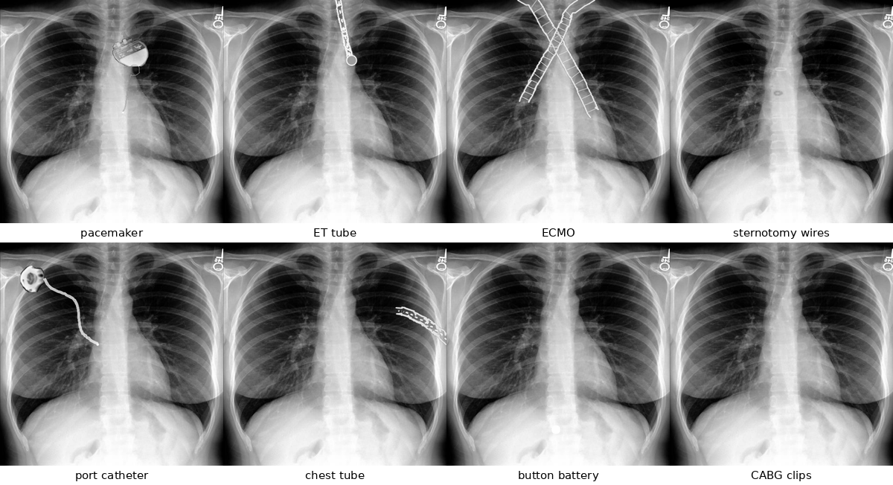
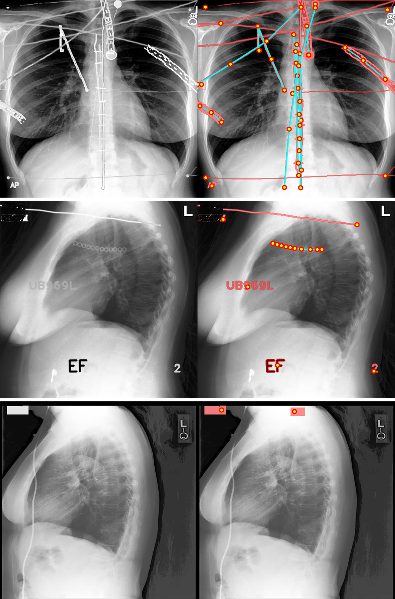

# CXR_SynthFB — Anatomy-Guided Foreign-Object Insertion for Chest X-Rays

Reimplementation + extensions of the data generation pipeline from:

> Seibold, Kalisch, Heine, Reiß, Kleesiek.
> *Foreign Object Segmentation in Chest X-Rays through Anatomy-Guided Shape Insertion.*
> arXiv:2501.12022 (2025).

This repo produces a **119-category COCO-format instance segmentation dataset** of synthetic chest X-rays containing foreign bodies (FBs) and support devices, generated from a clean (FB-free) subset of MIMIC-CXR via anatomy-guided shape insertion.

## Examples

Single-category renders (procedural, on a device-free MIMIC base image):



Full pipeline outputs — left: synthetic image, right: instance masks + keypoints:



All procedural categories on one demo CXR: [clean renders](assets/gallery_clean.jpg) | [with mask + keypoint overlay](assets/gallery_masks.jpg).

## What it generates

Each output image is a real MIMIC CXR with synthetic foreign objects rendered on top using anatomy-aware placement:

- **Cardiac rhythm**: pacemaker, ICD, CRT (3-lead), LVAD, IABP, Impella
- **Cardiac valves**: mechanical, annuloplasty ring, Watchman LAA closure, MitraClip, TAVR (mesh stent)
- **Vascular access**: PICC, port catheter, tunneled CVC, Swan-Ganz, dialysis catheter, ECMO cannulas
- **Airway**: ET tube, tracheostomy, double-lumen ET, NG tube, bronchial Y-stent, tracheal stent, endobronchial valve
- **Drains**: chest tube, mediastinal drain, PleurX, pericardial drain (pigtail)
- **Spine / ortho**: spinal rods + pedicle screws, anterior cervical plate, vertebroplasty cement, shoulder prosthesis, spinal cord stimulator
- **Breast / oncology**: implant, tissue expander port, lumpectomy clips, brachytherapy seeds, embolization coils, ablation antenna
- **Coronary**: CABG clips
- **Neuro**: VP shunt, EVD, cochlear implant
- **Surgical**: sternotomy wires, surgical staples, gossypiboma marker, mitral valve struts
- **Forensic / ingested**: pellet cluster, coin, button battery, magnet pair, safety pin, hairpin, aspirated FB, IVC filter
- **Pediatric**: UAC / UVC umbilical catheters
- **External artifacts**: halo cervical traction, defib pads, 5-lead cardiac monitor, EKG bundle, bra underwire, jewelry / piercings, text labels, film scratches
- **Sengstaken-Blakemore tube**, **esophageal stent**, **CardioMEMS sensor**, ...

Each annotation is rendered with one of seven physics modes (chosen per-category to match real radiologic appearance):

- `overlay` — solid replacement (large opaque implants)
- `soft_edge` — Gaussian-blurred alpha composite (skin-surface items)
- `beer_lambert` — distance-transform-based X-ray attenuation (thin tubes / wires)
- `occluded` — `soft_edge` + rib darkening through transparent structure (catheters behind ribs)
- `translucent_implant` — distance-transform alpha with bright rim + see-through core (pacemaker bodies, breast implants)
- `screen` — additive brightening over rib shadows (tubes that shouldn't replace bone)
- `xray_summed` — summed-attenuation composite

Each image also follows one of **23 patient archetypes** (post-CABG bundle, ICU complex, ECMO patient, chronic pacemaker, dialysis, oncology brachy, pediatric ingest, trauma, etc.) → realistic multi-device correlations + ~25% true-negative (no-finding) images.

## Keypoints

Annotations also carry per-category **COCO-format keypoints** so you can train keypoint / pose detectors alongside instance segmentation. Keypoint count varies per category:

- **1 kpt** (`center`) — symmetric objects: coin, breast implant, valves, generator bodies, cuffs, balloons, port reservoirs.
- **2 kpts** (`proximal_end`, `tip` / `skin_entry`, `tip` / `top`, `bottom` / `left_end`, `right_end` / `apex`, `base` / `start`, `end`) — tubes, leads, sternotomy wires, spinal rods, halo posts, IVC filter, lines.
- **3 kpts** (`junction`, `arm_a`, `arm_b`) — dialysis Y-split.

Keypoints are emitted natively by the shape/device functions (we own the geometry — Bezier endpoints, SDF anchors, etc.), with mask-centroid as fallback for single-`center` schemas. Out-of-frame kpts get `visibility=0` per COCO convention. Per-category skeleton (consecutive kpts) is also written for quick viz.

**Tight clusters (one device, many parts):** ring_chain, brachy_seeds, pellet_cluster, embolization_coils, lumpectomy_clips, magnet_pair emit **one annotation with N keypoints** (one per item, padded `v=0` up to schema max).

**Far-apart spread (each part its own device):** cabg_clip, dotted_screw, surgical_staple, monitor_lead_dot, monitor_lead_wire are **split into N annotations with 1 keypoint each** via connected components.

## Getting started

**1. Get MIMIC-CXR-JPG.** The base images are **not included** — MIMIC-CXR requires
credentialed access via [PhysioNet](https://physionet.org/content/mimic-cxr-jpg/2.0.0/).
Download the JPEGs and keep the `p*/s*/*.jpg` directory layout. We ran the pipeline on
images resized to 512 px short side; native resolution also works but is slower and produces
correspondingly larger outputs.

**2. Install.**

```bash
git clone https://github.com/ConstantinSeibold/CXR_SynthFB && cd CXR_SynthFB
pip install -r requirements.txt
```

**3. Generate.** The repo ships the exact device-free base-image pool used for the project —
`data/mimic_fb_free_pool.csv`, 2,015 PA/lateral/LL images (1,813 train / 100 val / 102 test),
filtered by report NLP plus an image-side purity check. `generate_synthfb.sh` picks it up
automatically, so this is all you need:

```bash
MIMIC_CLEAN=/data/mimic/images_512 ./generate_synthfb.sh -n 5000 -o ./synthfb_train --split train -s 0
```

The CSV only lists relative `img_path`s; they are resolved against `MIMIC_CLEAN`. Rows whose
file is missing on disk are skipped, so a partial MIMIC download still runs.

The first run downloads [CXAS](https://github.com/ConstantinSeibold/ChestXRayAnatomySegmentation)
anatomy-segmentation weights (network access required). CXAS masks (159 anatomical regions
per image) drive placement: catheters follow vessel courses, ET tubes end above the carina,
pacemakers sit in the pectoral pocket, etc. Masks are cached in `.cache_cxas/`, so only the
first pass over a source image pays the segmentation cost.

**4. Full rebuild** (train + val + test + zips) in one command:

```bash
MIMIC_CLEAN=/data/mimic/images_512 \
OUT_ROOT=./synthfb_v2 \
N_TRAIN=10000 N_VAL=1000 N_TEST=1000 \
  ./regenerate_dataset.sh
```

This also defaults to the shipped pool; point `CLEAN_POOL_CSV` at your own CSV to override.

`regenerate_dataset.sh` defaults to `FAST_MODE=1` (skips viz/gallery, JPG-95 images) for
production runs; set `FAST_MODE=0` for full PNG + debug outputs.

## Building your own base-image pool

`data/mimic_fb_free_pool.csv` is the pool we used; to rebuild or extend it, run the filter
yourself:

```bash
python prepare_mimic_subset.py --src /path/to/mimic_metadata.csv \
    --img-root /data/mimic/images_512 --out my_pool.csv
MIMIC_CLEAN=/data/mimic/images_512 ./generate_synthfb.sh -n 5000 --subset-csv my_pool.csv
```

The source metadata CSV needs columns `dataset_name`, `Mode`, `Support_Devices`,
`No_Finding`, `report`, `img_path`, `ViewDetailed`. The filter keeps MIMIC train images with
`Support_Devices` negative/uncertain/unlabeled (not positive) and `No_Finding==1`, then applies a sentence-level NLP gate over the
report text (device-noun regex with negation handling) so that base images are actually
device-free, and assigns a seeded train/val/test split over source images.

| env var | required | meaning |
|---|---|---|
| `MIMIC_CLEAN` | yes | directory containing `p*/s*/*.jpg` MIMIC-CXR JPEGs |
| `MIMIC_SUBSET_CSV` | no | base-image pool CSV; defaults to the shipped `data/mimic_fb_free_pool.csv` |
| `MIMIC_META_CSV` | no | source metadata CSV, only needed to build a new pool |
| `CUTOUTS_ROOT` | no | RGBA cut-paste pool; defaults to `cutouts/labels/` (empty, see below) |

## CLI args

```
Usage: ./generate_synthfb.sh [options]

  -n N            number of synthetic images to generate   (default 100)
  -o OUT_DIR      output directory                          (default ./synthfb_out)
  -s SEED         RNG seed                                  (default 0)
  --max-ann N     max annotations per image                 (default 12)
  --split SPLIT   train|val|test (default: all)             — source images disjoint;
                                                              with-replacement if N > pool
  --subset-csv P  explicit path to the subset CSV
  --skip-install  skip pip install
  --skip-subset   reuse existing subset CSV
  -h, --help      show help
```

## Train / val / test splits

The subset CSV has a `split` column (default 90% train / 5% val / 5% test, seeded). Source images are **disjoint across splits** — no image leakage.

When `-n N` exceeds the split's source pool, images are sampled **with replacement** (same source image re-used with different random foreign-object insertion). This lets you generate 50k training images from a 2k source pool.

```bash
./generate_synthfb.sh -n 50000 -o ./synthfb_train --split train -s 1000
./generate_synthfb.sh -n 2500  -o ./synthfb_val   --split val   -s 2000 --skip-subset
./generate_synthfb.sh -n 2500  -o ./synthfb_test  --split test  -s 3000 --skip-subset
```

**Two independent seeds:**
- `-s N` (gen seed) — drives augmentation/insertion RNG. **Must differ per split** so val/test don't get identical insertion patterns as train.
- `--split-seed N` (in `prepare_mimic_subset.py`, default 42) — decides which source images go in which split. **Keep constant across all 3 runs** so the split partition stays stable.

## Output layout

```
<OUT_DIR>/
├── images/000001.png ...        synthetic CXRs (RGB)
├── masks/000001.png  ...        uint16 instance maps (pixel value = annotation index)
├── annotations.json             COCO + per-image (view, archetype) + per-annotation render_mode
├── category_gallery.png         all categories on one demo CXR (w/ mask overlay)
├── category_gallery_clean.png   same, no mask overlay (for realism inspection)
├── category_examples/           per-category PNGs with mask overlay
├── category_examples_clean/     per-category PNGs without mask
└── mimic_fb_free_train.csv      filtered subset (only when built by the NLP filter)
```

## Cut-paste pool (optional, not included)

Besides the procedural categories, the pipeline can paste real device photographs (RGBA
cutouts) onto the base images. The pool we used internally was extracted from copyrighted
source material and is not redistributable, so `cutouts/labels/` ships empty and the
pipeline runs fully procedural by default — every code path that touches the pool checks
for its presence first.

To use your own pool, drop RGBA PNGs under `cutouts/labels/<category>/*.png`
(auto-discovered; each directory becomes a COCO class). `cutouts/labels/README.md`
documents the optional manifest that maps cutouts onto canonical SynthFB classes.

## Pipeline structure

`SynthFB.py` is one flat script, driven by env vars that the `.sh` wrappers set. Per image:

1. load the clean CXR + CXAS anatomy masks (cached in `.cache_cxas/`)
2. pick a patient archetype (or none), giving a required/optional device bundle
3. for each device: generate mask + color map + keypoints from its shape/device function,
   pick a legal physics mode, composite onto the image
4. emit COCO annotations (RLE mask + keypoints + `render_mode` + view + archetype)

Config surface (set by the wrappers, overridable): `SYNTHFB_N`, `SYNTHFB_MAX_ANN`,
`SYNTHFB_CUTPASTE_PROB`, `SYNTHFB_DEVICE_PROB`, `SYNTHFB_SEED`, `SYNTHFB_SPLIT`,
`SYNTHFB_SKIP_VIZ`, `SYNTHFB_SKIP_GALLERY`, `SYNTHFB_JPG_QUALITY` (0 = PNG),
`SYNTHFB_PNG_COMPRESS`, `SYNTHFB_PLACEMENT` (anatomy|fallback|random_body|random_general),
`SYNTHFB_CLASS_FRAC`, `SYNTHFB_ISOLATE` (render exactly one device family per image).

Note on the paper: the original paper used 9 primitive shapes + cut-paste only
(~13 categories). This implementation extends that to 119 categories with anatomy-aware
placement, lateralization priors, tip-position priors, patient archetypes, and
physics-based rendering.

## What's NOT included

- MIMIC-CXR images (credentialed data — bring your own copy; the shipped pool CSV lists
  file names only).
- The cut-paste cutout pool (see above).
- Training the instance segmentation networks. This repo only generates the dataset.

## License

MIT (see `LICENSE`).

## Citation

If you use this, please cite:

```bibtex
@article{seibold2025synthfb,
  title={Foreign Object Segmentation in Chest X-Rays through Anatomy-Guided Shape Insertion},
  author={Seibold, Constantin and Kalisch, Hamza and Heine, Lukas and Rei{\ss}, Simon and Kleesiek, Jens},
  journal={arXiv preprint arXiv:2501.12022},
  year={2025}
}
```
